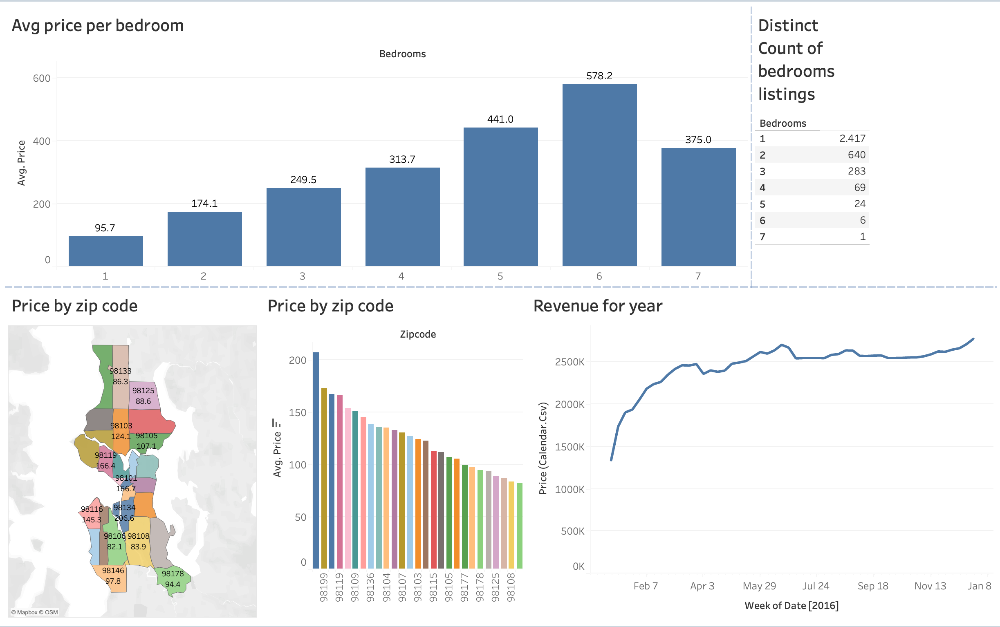

# Airbnb Data Visualization Project (Tableau)

## Project Description
This project focuses on analyzing Airbnb data using Tableau to generate interactive dashboards and valuable insights.  
The goal is to explore patterns, trends, and key performance indicators (KPIs) related to Airbnb listings, pricing, availability, and customer behavior.

## Features
- Interactive Dashboards  
- Price Analysis per Location  
- Geographical Distribution of Listings  
- Availability & Review Patterns  
- Host & Property Insights  

## Tools Used
- Tableau (`.twb` Project File)  
- Data Visualization Techniques  
- Airbnb Dataset  

## How to Open
1. Download the `Airbnb Full project.twb` file from this repository.  
2. Open it using Tableau Desktop.  
3. Explore the dashboards and interact with the visualizations.  

## Sample Output

Here is a preview of the Airbnb Dashboard:

  

